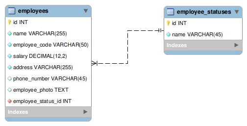

# Laravel Livewire Desde Cero Ejercicio Practico

### Ejercicio Final: Crear un CRUD de Empleados con las siguientes instrucciones

1. Crear el siguiente esquema de base de datos utilizando los modelos y migraciones de Laravel.

