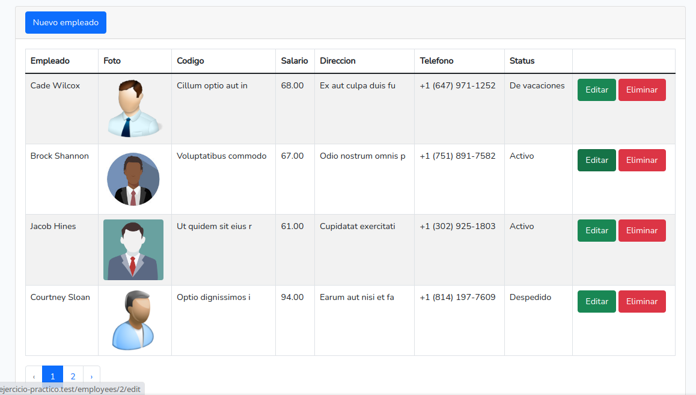
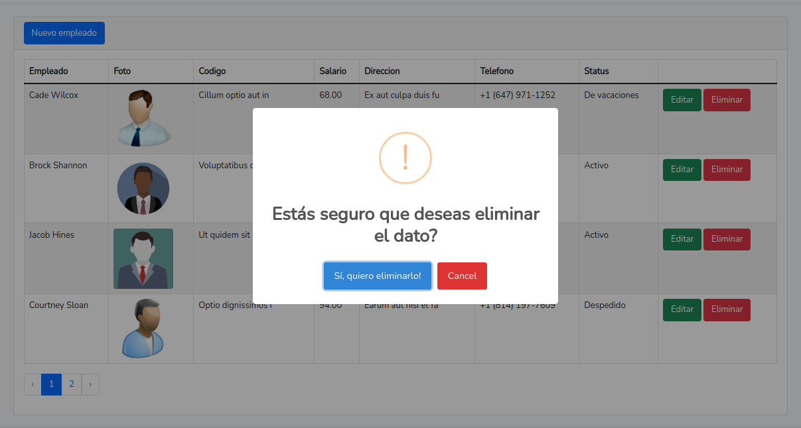

# Laravel Livewire Desde Cero Ejercicio Practico

### Ejercicio Final: Crear un CRUD de Empleados con las siguientes instrucciones

**1. Crear el siguiente esquema de base de datos utilizando los modelos y migraciones de Laravel.**

- Donde los campos: **employee_photo** y **phone_number** son campos opcionales
- La tabla de employees debe estar relaciona con la tabla employee_statuses.

**2. Se debe crear la siguiente tabla**

- Se debe poder visualizar la foto de cada empleado en caso se registren con una.
- Se debe visualizar la paginación como en la imagen. (Pueden paginar desde la cifra que ustedes elijan. Ej. 10 datos, 25 datos, etc.)
- El estilo es opcional pueden utilizar bootstrap o tailwindcss

**3. Eliminar empleados**
- Al dar click al botón eliminar se debe ver la siguiente pantalla (SweetAlert con eventos y parámetros) y solamente al confirmar se elimina el dato.

